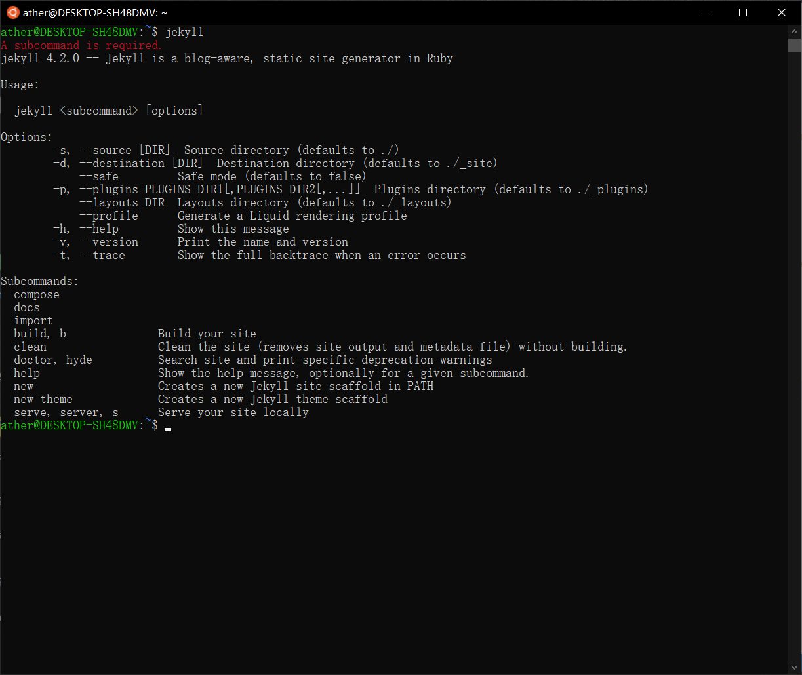
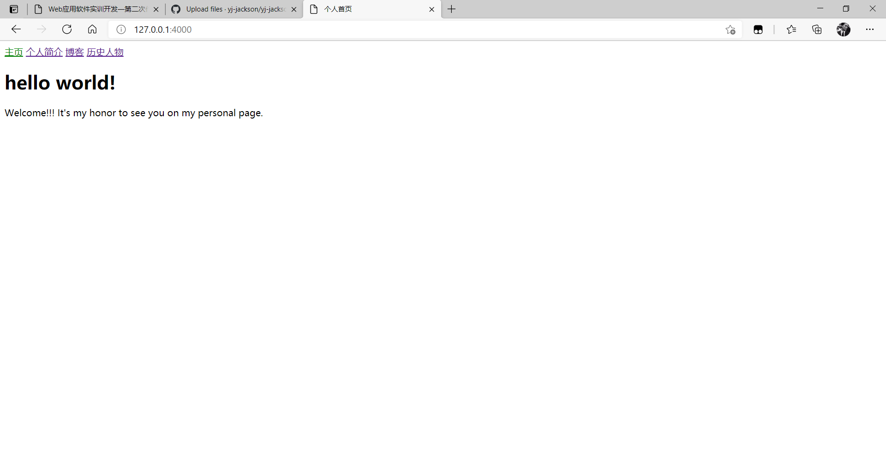
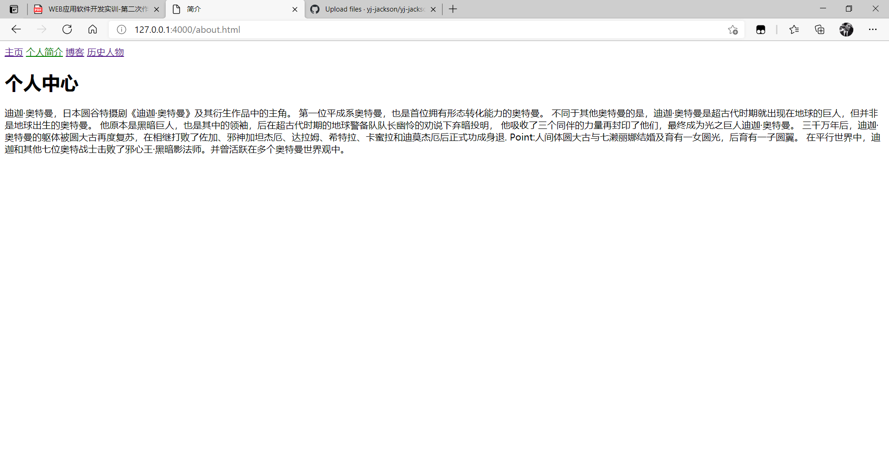
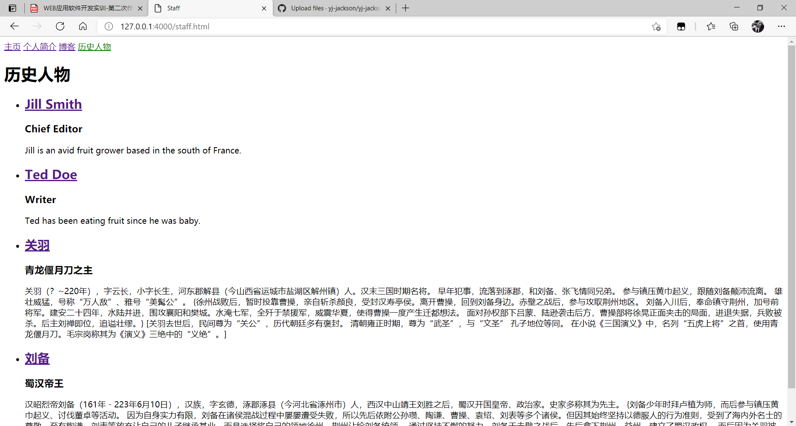
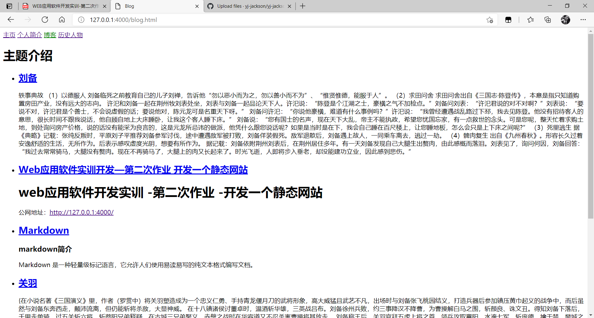

web应用软件开发实训 -第二次作业 -开发一个静态网站
公网地址：<http://127.0.0.1:4000/>    

github仓库地址： <https://yj-jackson.github.io/>  

## 一.网站目录结构

## 二.截图
1.首页

2.作者简介

3.staff页面

4.about页面

## 三.实验过程
> 1. 在wsl上安装Jekyll
> 2. 安装vscode以及remote，并通过remote插件链接wsl
> 3. 通过Jekyll build 编译网站并将_site目录部署到服务器中
> 4. 将代码push 到gihub 打开网页正常运行

## 四.总结
> 1. 在实验过程中，遇到nginx服务启动一直失败的问题，解决方法是切换到root模式。
> 2. push代码到GitHub过程中一直报错，查阅资料得知，是因为在github上创建仓库的时候，顺便也创建了README文件，然而本地仓库又没有这个文件，所以导致版本冲突。
有以下几种解决方法：  
(1)、强制push到远程仓库：  
git push -u origin master -f  
(2)、push前先将远程仓库pull下来，再进行push：  
git pull origin master
git push -u origin msater  
(3)、创建新的分支：  
git branch [name]  
git push -u origin [name]
> 3. 实验心得体会:  
通过本次实验，我学会了Jekyll网站开发的基本应用，如何配置服务器并解析域名，并且熟悉了markdown的各种操作和基本语法和git命令行的操作方法。